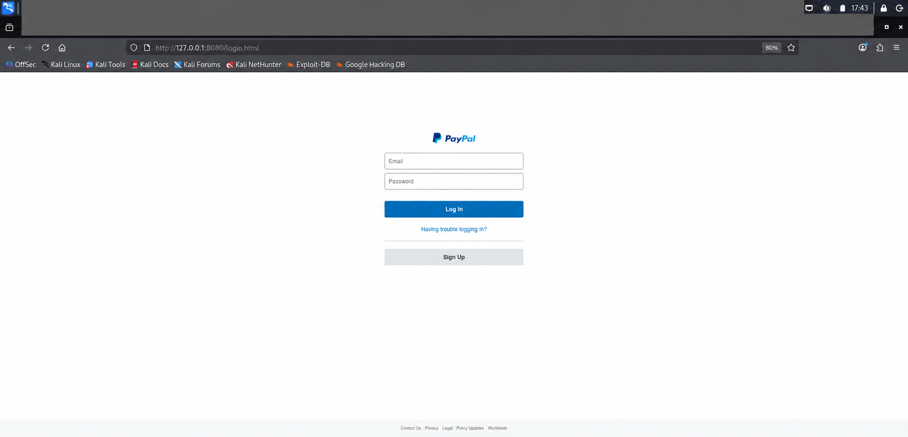
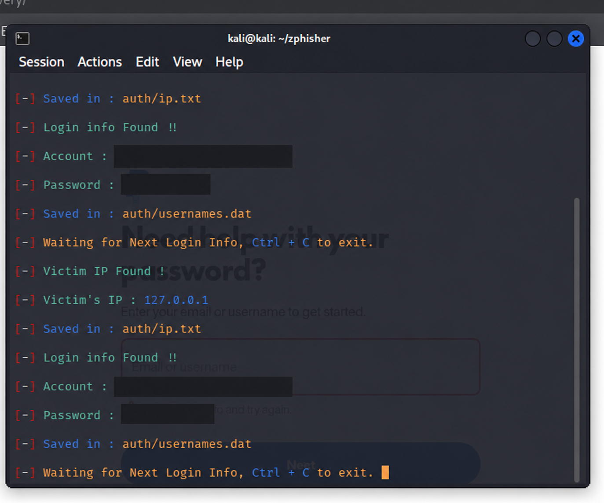
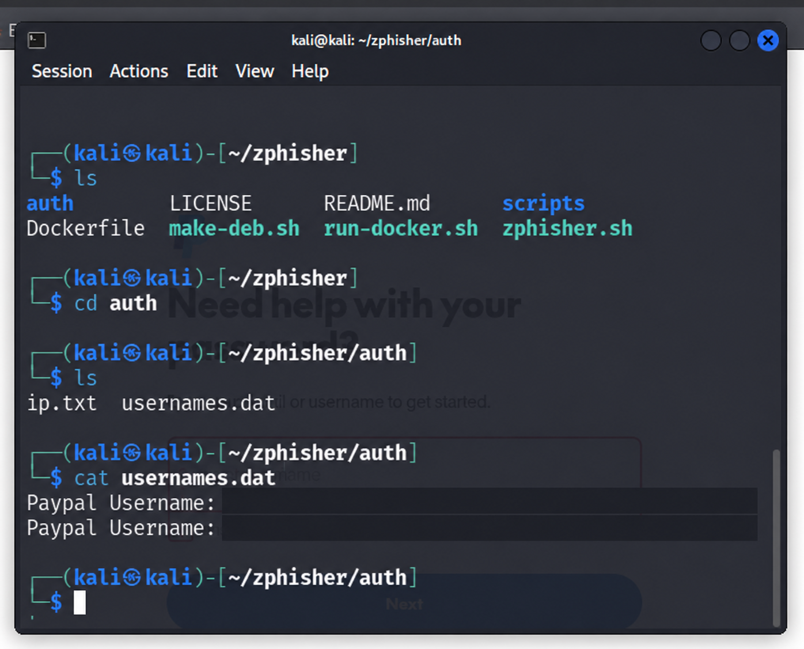

# Local Phishing Simulation Lab
## Credential Submission Demonstration and Awareness Lessons

> **Platform:** Kali Linux and Zphisher 2.3.5  
> **Observed page:** `http://127.0.0.1:8080/login.html`  
> **Purpose:** Educational demonstration using test input  
> **Evidence:** Local replica login page, terminal submission output, and saved-file inspection

## Overview

This project demonstrates how a replica login page can collect submitted values in a local lab. The screenshots show a PayPal-branded replica accessed through a loopback address, submission output in a terminal, and values stored in a local file.

This was a technical demonstration, not a measured organizational awareness campaign. No participant roster, delivered phishing messages, tracking dashboard, training attendance, or before-and-after measurements are shown. Click rates, submission rates, and reporting rates are therefore not claimed as results.

The original project notes state that the exercise was authorized and used fictitious credentials. Screenshots support the local demonstration but cannot independently establish authorization or whether an account string belongs to a real person. All submitted account and password values are redacted from portfolio images.

## Objectives

- Observe the difference between a page's visual branding and its actual origin.
- Demonstrate that submitted test values can appear in terminal output and local storage.
- Explain confidentiality risks associated with entering credentials on an untrusted page.
- Identify awareness lessons and defensive controls.
- Document evidence accurately without publishing submitted values or claiming unmeasured outcomes.

## Scope and boundaries

| Item | Documented scope |
|---|---|
| Device environment | Kali Linux lab |
| Framework version | Zphisher 2.3.5, visible in the startup screenshot |
| Page access | Loopback URL `127.0.0.1:8080` |
| Replica branding | PayPal-style login template; not the legitimate PayPal service |
| Submission evidence | Two account/password pairs visible in the original output, now redacted |
| Local file | `auth/usernames.dat`, shown during file inspection |
| Participants | No real-user campaign evidenced |
| Distribution | No public link, email delivery, or external campaign distribution evidenced |

A loopback URL indicates local access; it does not prove that the whole environment was isolated or that every server listener was restricted to loopback. Network configuration and listener-binding evidence were not supplied.

## Documented workflow

### 1. Local preparation

The screenshots show creation of a simulation directory, retrieval of the tool source, and inspection of the framework files. The clone output places the repository in the home directory rather than demonstrating that all files were contained within the simulation directory.

Setup screenshots are optional and are not required to understand the result. This README does not provide a deployment guide or public hosting instructions.

### 2. Replica login page

A PayPal-style page was displayed at `http://127.0.0.1:8080/login.html`. Its visual branding resembles a legitimate service, while the address identifies a local page.

**Lesson:** Recognizable branding does not establish legitimacy. Check the actual site origin before entering information. HTTPS alone would also not establish that a site is trustworthy.

### 3. Test-value submission

The terminal output shows two account/password submissions and a save location. A loopback client address, `127.0.0.1`, appears in the output.

**Observation:** Values entered into the replica page appeared in the tool output. This demonstrates collection of test input; it does not demonstrate compromise of a real account.

### 4. Local storage inspection

The file-inspection screenshot shows the contents of `usernames.dat` containing two recorded entries. The original image displays readable account and password values. Those values are concealed in the portfolio copy.

**Lesson:** Screenshots, logs, and saved output can expose submitted information. They require careful handling even in an educational exercise.

## Evidence-based results

| Observation | Supported conclusion | What it does not establish |
|---|---|---|
| Replica page displayed at loopback URL | A local branded login demonstration was accessed | Public deployment or message delivery |
| Submission values appeared in terminal output | The demonstration collected test input | Successful login to a legitimate service |
| Two entries appeared in local storage | Submitted data was retained locally | Two unique participants or a campaign submission rate |
| No campaign analytics supplied | Behavioural metrics cannot be calculated | Awareness improvement or reduction in organizational risk |

No participant susceptibility baseline, delivered awareness intervention, or post-training behaviour change is evidenced. Two submissions are not a percentage without a defined population and campaign denominator.

## Awareness lessons

- A copied logo and familiar layout can appear on an unrelated page.
- Check the destination and context of a login request before entering information.
- Use a trusted bookmark or known service address when a message unexpectedly requests sign-in.
- Report suspicious requests through the organization's established channel.
- Submitting a password can expose it, but account access also depends on validity, MFA, and other controls.
- Avoid reusing passwords; compromise of one password may affect other accounts when reuse occurs.

These are lessons derived from the mechanism demonstrated. They are not measured training outcomes.

## Future awareness-campaign measurement plan

The following metrics are proposed for a future approved campaign, not measured in this lab:

| KPI | Proposed definition | This lab's result |
|---|---|---|
| Click rate | Unique recipients clicking the simulation link / successfully delivered recipients × 100 | Not measured |
| Submission rate | Unique recipients submitting designated simulation input / successfully delivered recipients × 100 | Not measured |
| Reporting rate | Unique recipients reporting the simulation / successfully delivered recipients × 100 | Not measured |

Campaign measurement should define the time window, deduplication rules, exclusions, and denominator before testing. Automated link inspection can affect click telemetry and must be considered. Before-and-after comparisons require comparable groups, delivery conditions, and lure difficulty.

A future awareness exercise should avoid collecting real passwords. Use a designated simulation action or synthetic input and record only the minimum data needed for the learning objective.

## Defensive recommendations

1. Provide practical training on verifying destinations and responding to unexpected sign-in requests.
2. Make reporting simple and reinforce reporting without blame.
3. Use email and web filtering alongside awareness training.
4. Use MFA, prioritizing phishing-resistant authentication where supported.
5. Review access controls and suspicious sign-in monitoring to reduce the impact of exposed credentials.
6. Keep test output out of public repositories, and remove it after the authorized retention period.

These recommendations were not implemented or tested by the supplied screenshots. This lab does not demonstrate that any specific control was bypassed.

## Privacy and screenshot checklist

Create a **`Screenshots`** folder beside `README.md` and upload only these prepared images:

| Portfolio filename | Original source | Redaction |
|---|---|---|
| `01-local-replica-page-redacted.png` | `6-dummy_page(1).png` | Unrelated browser tabs concealed; local URL retained |
| `02-submission-output-redacted.png` | `7-auth_login_details(1).png` | Account and password values concealed |
| `03-local-storage-redacted.png` | `8-cat-usernames_dat_(1).png` | Account and password values in both stored entries concealed |

The originals and duplicate “Copy” images are not needed in the public repository. The tool-menu and cloning screenshots add little evidence of the outcome and are omitted from the main presentation. Loopback addresses and generic Kali prompts are retained because they explain the lab context.

Do not upload raw `auth/` output, credential files, real account information, or browser-session data. Redacted images are privacy-edited evidence copies, not evidence of additional technical results.

## Limitations

- Evidence is limited to screenshots and the supplied project notes.
- Loopback access is shown, but complete network isolation is not verified.
- No organizational user campaign, message-delivery record, or participant consent record was supplied.
- No measured KPIs, pre/post training comparison, or awareness-effectiveness evaluation is available.
- No real account compromise, MFA bypass, session theft, or security-control effectiveness was demonstrated.
- No exact exercise date is assigned because it is not established by the supplied evidence.

## Skills demonstrated

Local lab observation, phishing-mechanism analysis, evidence documentation, privacy-aware reporting, awareness-content planning, and KPI-definition design.

## Author and assessment context

**Olayemi Owoeye — Cybersecurity Portfolio**

The project notes describe authorized educational use with fictitious test credentials. This documentation focuses on the local demonstration and defensive lessons. It does not claim a completed organizational phishing campaign or measured improvement in user behaviour. Product branding in the replica does not imply affiliation with or endorsement by the legitimate service.
